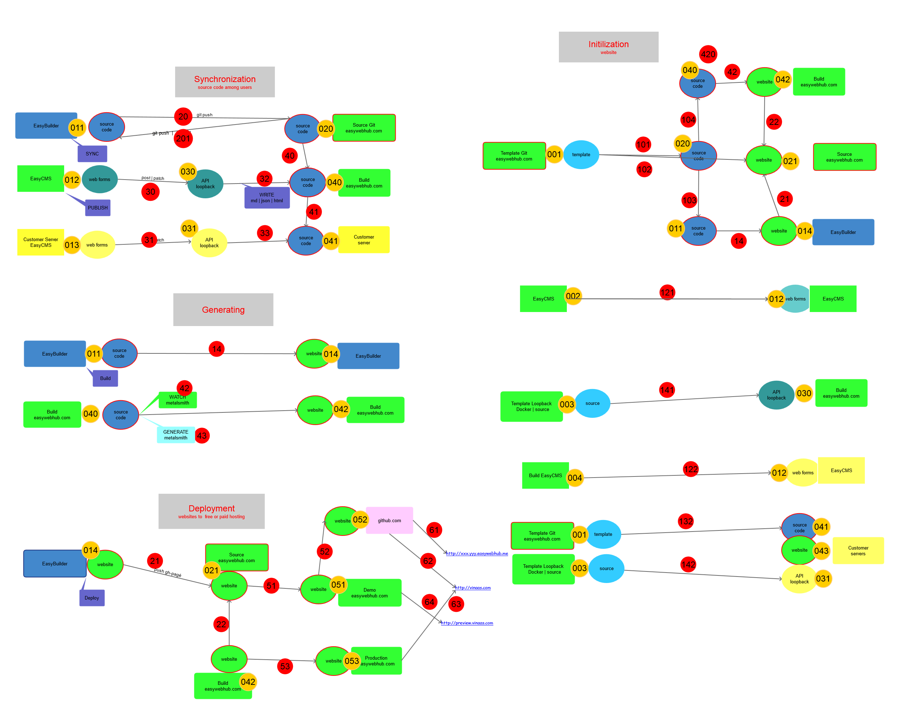

### Overview
> Xem hình tổng quan

- 

## Thiết lập:

- `userName`: tên khách hàng, duy nhất, `websiteName`: tên website, duy nhất theo từng khách hàng
- http://websiteName.userName.easywebhub.me:  domain tự động tạo theo từng website
    - ví dụ: http://vinaas.showcase.easywebhub.me

### Các phần của website: 
- web front: lựa chọn từ nhiều template nằm trong easyMarket
    - `001`: Pillar tempalte:- https://sourcecode.easywebhub.com/templates/pillar.git  (user/pass gửi riêng)
    - `011`: sourceCode: ở branch master
    - `014`: website: ở branch gh-pages, có thể clone về, click vào file `index.html` để xem website 
    - khi `014` được deploy lên github.com, ở `052`, và trỏ domain, nó sẽ là thế này https://easywebhub.com/

- web admin (easyCMS)
- api backend (loopbackAPI)

## Giải thích

### Script tự động
- là số màu đỏ 
- Thiết lập website mới: 3 chữ số bắt đầu bởi 1
- Website vận hành: 2 chữ số 
- Chuyển đổi giữa các hình thực triển khai 

### 3 đối tượng khách hàng
- Free EasyWeb cloud miễn phí 
- Premium EasyWeb: dịch vụ cloud tính phí
- EasyWeb OnPremise: triển khai trên server khách hàng

### 3 hình thức triển khai
- EasyBuider: Phần mềm trên máy tính cá nhân
- EasyCMS: web page chung cho tất cả account EasyWeb
- CustomerCMS: cms riêng cho từng khách hàng

    
    