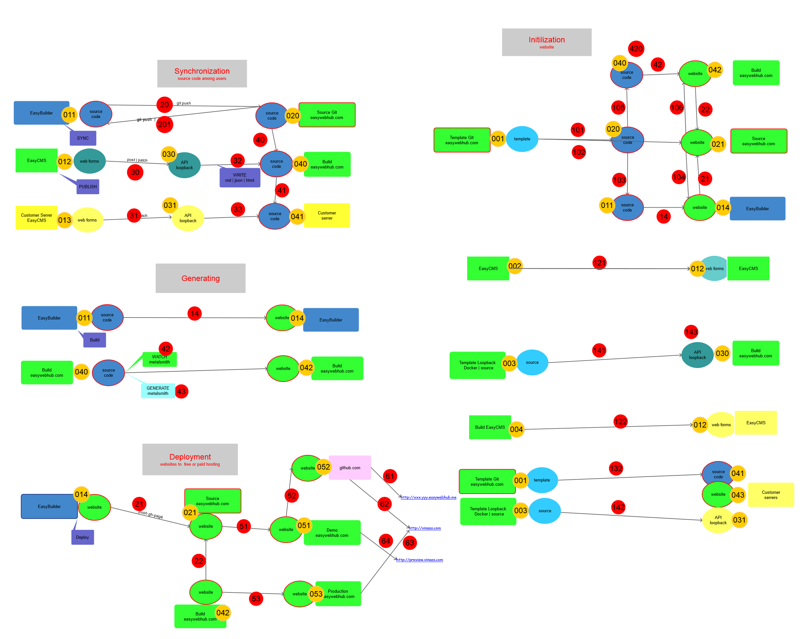

### Overview
> Xem hình tổng quan

- 

## Thiết lập:
> Người dùng chỉ cần nhập tên website, websiteName, hệ thống tự xử lý và sinh ra website cần thiết

- `userName`: tên khách hàng, duy nhất, `websiteName`: tên website, duy nhất theo từng khách hàng
- http://websiteName.userName.easywebhub.me:  domain tự động tạo theo từng website
    - ví dụ: http://vinaas.showcase.easywebhub.me

### Các phần của website: 
> tài liệu: hình mô họa https://github.com/easywebhub/tasks/blob/master/docs/architect/EasyWeb-Ecosystem.png?raw=true

- Web UserFront:  website dành cho người xem 
    -lựa chọn từ nhiều template nằm trong easyMarket
    - gồm 2 phần: 
        - sourceCode: chứa dữ liệu của website, admin nhập vào luư thành file .md
        - Website: chứa HTML, CSS, JS, ... cho website hoạt đông
- Web StaffAdmin (easyCMS)
- api backend (loopbackAPI)

### Ví dụ thực tế
- `001`: Pillar tempalte:- https://sourcecode.easywebhub.com/templates/pillar.git  (user/pass gửi riêng)
- `011`, : `sourceCode`: ở branch master, thư mục chứa nhiều loai files, chủ yếu là .md
- `014`: website: ở branch gh-pages, có thể clone về, click vào file `index.html` để xem website 

- `052`: là `website` được deploy lên github.com: 
    -  https://github.com/ewh-support/vinaas.showcase  hoặc https://github.com/ewh-support/doan.doan
    -  danh sách website ở https://github.com/ewh-support?tab=repositories
    -  
- `61`: domain tự sinh ra: http://vinaas.showcase.easywebhub.me/ trỏ vào `052`
- `004` và `012` : https://github.com/vinaas/nguyenkim_easyquiz, gh-pages branch
- `003` và `030` : thu mục https://github.com/vinaas/easyquiztest/tree/master/backend

## Giải thích

### Script tự động
- là số màu đỏ 
- Thiết lập website mới: 3 chữ số bắt đầu bởi 1
- Website vận hành: 2 chữ số 
- Chuyển đổi giữa các hình thực triển khai 

### 3 đối tượng khách hàng
- Free EasyWeb cloud miễn phí 
- Premium EasyWeb: dịch vụ cloud tính phí
- EasyWeb OnPremise: triển khai trên server khách hàng
- Chuyển đổi giữa các hình thực triển khai 
### 3 hình thức triển khai
- EasyBuider: Phần mềm trên máy tính cá nhân
- EasyCMS: web page chung cho tất cả account EasyWeb
- CustomerCMS: cms riêng cho từng khách hàng
    
    