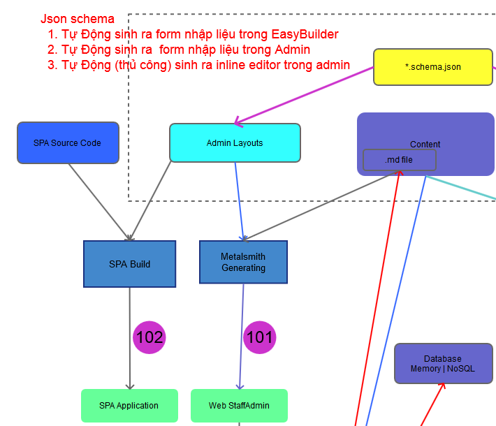

# Sử dụng EasyWeb | EasyBuilder như 1 công cụ toàn diện

## Mục tiêu

- UserFrontend thực hiện hoàn toàn bằng EasyBuilder
- Staff AdminCP: thực hiện bằng EasyBuilder:
    - Hoàn toàn: CMS cho quản trị websites
    - Một phần: Prototype tính năng hoạt động, 
    - chuyển đổi tự động sang các framework chuyên biệt như VueJS | React | Aurelia | AngularJS | ...

## Mô hình tổng quan:

### Thực hiện Số 02: Staff AdminCP

#### Số 101 :
##### Ưu điểm:
- Tương thích hoàn toàn với EasyBuilder hiện tại
- Sử dụng được với tất cả HTML Admin themes có sẵn:
    - không cần kiến thức để customize

- Tích hợp Web Services (như ExpressJS) để tạo thành web pages
##### Nhược điểm:
- nhược điểm của website tĩnh: 
    - generating lâu với dữ liệu lớn
    - không có router: đăng nhập | 
- khó khăn cho tương tác API backend
    - call API độc lập theo từng trang 

#### Số 102: 

#### Ưu điểm:
- Ưu điểm của SinglePage Application:
- kiểm soát tương tác với API backend    

#### Nhược điểm:
- khả năng tùy biến : cần build từ source code?
- Cấu trúc Source phức tạp: 

#### Câu hỏi?
- Cách số 101: 
    - chưa rõ đáp ứng được yêu cầu của 1 Web AdminCP thực tế? 
        - Bảo mật
        - Hiệu năng khi mở rộng
    - Tích hợp Web Services (như ExpressJS) để bổ sung tính năng của web động:
        - bảo mật
        - routing

- Cách số 102: 
    - Sử dụng được layouts do EasyBuilder tạo ra?
        - có thể điều chỉnh EasyBuilder
    - Tự động Build dựa trên layout có sẵn?
    - Hoạt động như 1 phần của EasyBuilder?
        - EasyBuilder tạo layouts, json data
        - Preview tức thời trang AdminCP tạo ra, tương tự cách dụng các Editor như VS Code chạy với Webpack

## Chi tiết
### UserFrontend: Websites
- [x] giao diện riêng cho từng khách hàng :
    - sử dụng bất kì themes có sẵn : từ themeforest, ...
    - lấy từ website có sẵn

- [x] cấu trúc dữ liệu cho từng website
    - bài viết tin tức
    - dữ liệu cho trang chủ 
    - thông tin sản phẩm 

- [x] Tính năng đơn giản, trực quan
    - tự động tạo domain, hosting
    - build và preview nhanh chóng
    - công cụ định nghĩa dữ liệu dễ sử dụng

### CMS AdminCP cho website: 
-  [ ] form nhập liệu: cho các component cơ bản
    - text input
    - datetimepicker
    - select (single | multiple)
    - file upload
    - wysiwyg editor: CkEditor | ...
    - ...

- [ ] inline editor
    - text input
    - datetimepicker
    - select (single | multiple)
    - file upload
    - wysiwyg editor: CkEditor | ...
    - ...

- [ ] giao diện tùy biến theo khách hàng
    - domain truy cập riêng
    - trang đăng ký | đăng nhập riêng
    - giao diện vận hành riêng 
    - menu riêng theo từng tính năng 

### API backend
> NoSQL database: Memory | Mongodb | Couchbase ...

- [ ] hiển thị thông tin
    - danh sách trang riêng

    - danh sách bài viết
    - danh sách Danh Mục 
    - danh sách GiaoDien

- [ ] cập nhật     
    - bài viết chi tiết
    - Danh Mục
    - upload files 

- [ ] tích hợp với các API services khác 