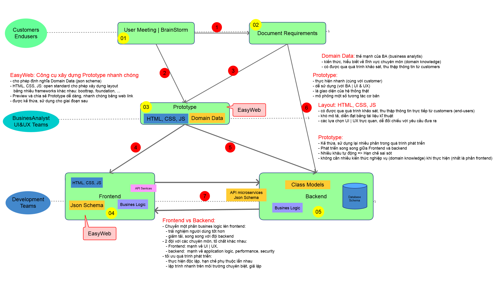
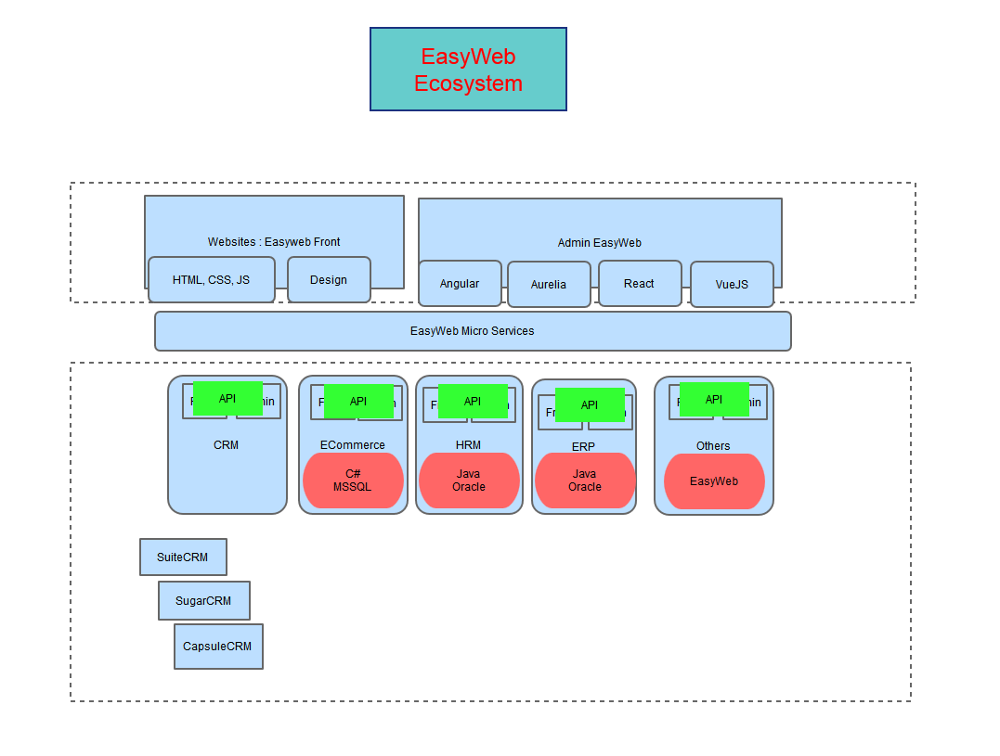
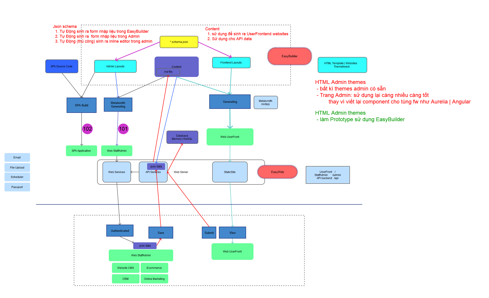

# Khả năng của EasyWeb

## Tổng Quan 
> Quy trình phát triển

## Áp dụng vào Dự án Thực Tế
### 1. Prototype: tạo ra Prototype dựa theo yêu cầu

- Hệ thống EIC:  http://eic-demo.vinaas.com 
- KieuHoi    https://vinaas.github.io/admin-page-template/ 

> Chi tiết về [Prototype]()
### 1. UserFrontend: Tạo ra website mới từ themes có sẵn hoặc từ websites có sẵn
- https://thuysan247.com
- http://demo.thoibaophuongdong.vn

### 1. StaffAdminCP: tạo ra trang quản trị từ HTML Admin themes có sẵn
- xây dựng dựa trên Prototype 
- tùy chọn Frontend framework sử dụng: SinglePageAppcation (SPA) hoặc Web pages
    - EIC: http://qlgd.eic.com.vn
    - KieuHoi  http://kieuhoi.vinaas.com 

## Hướng phát triển

### (1-1-n+): EasyWeb cho Doanh Nghiệp
> Slide chi tiết, [download](https://github.com/easywebhub/tasks/raw/master/docs/architect/EasyWeb.pptx)

- (1-1-n+) là mô hình gồm
    - 1 UserFront: giao diện dành cho người dùng không cần đăng nhập
    - 1 StaffAdmin: giao diện dành cho Nhân Viên vận hành, hoặc trang quản trị của người dùng sau khi đăng nhập
    - n+ backend: n hệ thống rời rạc với nhiều nghiệp vụ khác nhau. 

## Hệ sinh thái EasyWeb 

## All-in-one Easyweb: UserFrontend vs StaffAdminCP

- sử dụng EasyBuilder để xây dựng Prototype cho Frontend và AdminCP

- Chuyển đổi Prototype sang Web Front hoàn chỉnh

## UserFrontend: website builder
> phù hợp cho xây dựng website, không phù hợp cho vận hành thực tế

### Pros: ưu điểm 
1. tạo website mới nhanh chóng
    - từ template có sẵn
    - Build và Preview trên máy cá nhân: 
    - **Deploy**: chia sẻ website từ domain thiết lập sẵn 
    - **Sync**: Đồng bộ source code trên server, chia sẻ cho các máy khác, account khác

1. Đầy đủ tính năng website cần
    - tạo nhanh layout mới bằng cách copy html, css
    - `Config`: định nghĩa cấu trúc dữ liệu cho website 
    - hiển thị dữ liệu theo ý muốn, sử dụng `handlebarjs` query

1. Điều chỉnh theo yêu cầu dễ dàng, cho phép Preview tức thời

### Cons: hạn chế    

1. Sử dụng
    - cài đặt phần mềm EasyBuilder
    - build lâu với các máy yếu
1. Nhập liệu
    - form cứng nhắc, khó đáp ứng với lượng thông yeu-cau-giam-dinh nhiều
    - thiếu dropdownbox: liên kết với các danh mục khác
    - tìm kiếm bài viết, thông yeu-cau-giam-dinh còn yếu

1. Vận hành: thiếu các tính năng tự động, nâng cao
    - hẹn giờ đăng yeu-cau-giam-dinh bài | ẩn bài

## Luyện Tập EasyBuilder với các yêu cầu thực tế
- sử dụng, nghiền ngẫm EasyBuilder 

## Đưa ra UI | UX phù hợp với yêu cầu của khách hàng
- tìm hiểu, nghiền ngẫm các template ví dụ Metronic (hoặc pages )
