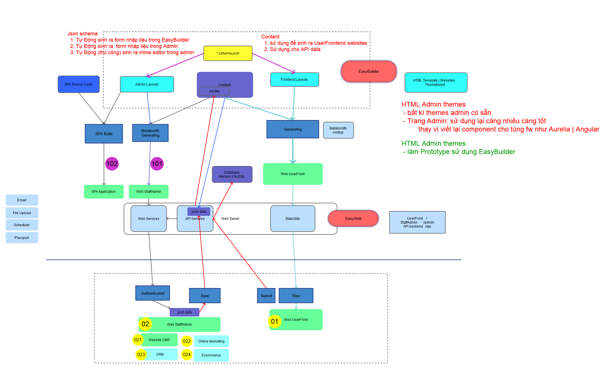

# Khám phá khả năng của EasyBuilder

## Tổng hợp
### 1. Prototype: tạo ra Prototype dựa theo yêu cầu
- Admin Prototype: ví dụ: [Metronic v5](http://mymetronic02.showcase.easywebhub.me/)
    - Menu tự động sinh ra dựa trên Danh Mục
    - Trang Chi Tiết đối tượng: hành động tạo mới | xem chi tiết | ...
    - Trang Danh Sách danh sách đối tượng, cho phép phân chia theo trạng thái

- EIC eic-demo.vinaas.com
- KieuHoi     
    
### 1. UserFrontend: Tạo ra website mới từ themes có sẵn hoặc từ websites có sẵn
- https://thuysan247.com
- demo.thoibaophuongdong.vn

### 1. StaffAdminCP: tạo ra trang quản trị từ HTML Admin themes có sẵn
- xây dựng dựa trên Prototype 
- tùy chọn Frontend framework sử dụng: SinglePageAppcation (SPA) hoặc Web pages
    - EIC: http://qlgd.eic.com.vn
    - 

> Quy trình phát triển

## All-in-one Easyweb: UserFrontend vs StaffAdminCP


- sử dụng EasyBuilder để xây dựng Prototype cho Frontend và AdminCP

- Chuyển đổi Prototype sang Web Front hoàn chỉnh

## Hệ sinh thái EasyWeb 


## UserFrontend: website builder
> phù hợp cho xây dựng website, không phù hợp cho vận hành thực tế

### Pros: ưu điểm 
1. tạo website mới nhanh chóng
    - từ template có sẵn
    - Build và Preview trên máy cá nhân: 
    - **Deploy**: chia sẻ website từ domain thiết lập sẵn 
    - **Sync**: Đồng bộ source code trên server, chia sẻ cho các máy khác, account khác

1. Đầy đủ tính năng website cần
    - tạo nhanh layout mới bằng cách copy html, css
    - `Config`: định nghĩa cấu trúc dữ liệu cho website 
    - hiển thị dữ liệu theo ý muốn, sử dụng `handlebarjs` query

1. Điều chỉnh theo yêu cầu dễ dàng, cho phép Preview tức thời

### Cons: hạn chế    

1. Sử dụng
    - cài đặt phần mềm EasyBuilder
    - build lâu với các máy yếu
1. Nhập liệu
    - form cứng nhắc, khó đáp ứng với lượng thông yeu-cau-giam-dinh nhiều
    - thiếu dropdownbox: liên kết với các danh mục khác
    - tìm kiếm bài viết, thông yeu-cau-giam-dinh còn yếu

1. Vận hành: thiếu các tính năng tự động, nâng cao
    - hẹn giờ đăng yeu-cau-giam-dinh bài | ẩn bài


## StaffAdminCP: prototype 

### Cấu trúc cơ bản của trang AdminCP:
- chia theo partial: `eHeader` , `eMenu`, `eFooter` (sử dụng prefix `e`: easyweb)

- thiết lập `Partial/default`, cho phép các trang khác **extend** từ đó

### Domain Data: cấu trúc dữ liệu 

#### Vận dụng Category
##### 1. Làm menu:
- category, sub-category, ... dùng là menu, sub-menu,...
- sử dụng `displayName` của category, hoặc thêm thông yeu-cau-giam-dinh trong `metadata` là thông yeu-cau-giam-dinh hiển thị mở rộng
- dùng `href` là url cho menu 
- minh họa
```
/PhongBan 
|__PhongKinhDoanh 
    |__ NhanVien 
        - nguyen-van-a 
        - nguyen-van-b 
    |__ TruongPhong 
|__PhongVanHanh
|__BanGiamDoc
....
```

##### 2. Hiển thị danh sách
- danh sách phòng ban:
    - `{{#each (lookupCategory AllCategory 'phongban' 'children')}}`

- tất cả nhân viên phòng kinh doanh 
    - `{{#each (lookupCategory AllCategory 'phongban.phongkinhdoanh' 'files')}}`
- trưởng phòng phòng kinh doanh
    - `{{#each (lookupCategory AllCategory 'phongban.phongkinhdoanh.truongphong' 'files')}}`

##### 3. Dùng phân biệt trạng thái của đối tượng
- minh họa
```

    |__YeuCauGiamDinh
        |__ChuaDuyet
            - yeu-cau-giam-dinh-01
        |__ĐaDuyet
            - yeu-cau-giam-dinh-02
            - yeu-cau-giam-dinh-03
            - yeu-cau-giam-dinh-04
        |__TuChoi
            - yeu-cau-giam-dinh-05
    |__VuGiamDinh 
        |__ChuaChiDinh
            -vugiamdinh-01
        |__DaChiDinh
            -vugiamdinh-02
    |__ChungThu
    |__HoaDon

```

- danh sách YCGD chưa duyệt: 
    - `{{#each (lookupCategory 'YeuCauGiamDinh.ChuaDuyet' 'files')}}`
- tất cả YCGD: 
    - `{{#each (lookupCategory 'YeuCauGiamDinh' 'files')}}`

- đổi trạng thái, chỉ cần đổi category của chi tiết tương ứng
    - đổi **yeu-cau-giam-dinh-01** từ `ChuaDuyet` sang `DaDuyet`, chỉ cần đổi category trong `Form`


##### 4. Dùng trong dropdownbox
- Dùng trong filter, Form chi tiết , ...
    - filter theo trạng thái: `{{#each (lookupCategory AllCategory 'yeucaugiamdinh' 'children') }}`
    - ví dụ **Chon Phong Ban**, `{{#each (lookupCategory AllCategory 'phongban' 'children')}}`


#### Vận Dụng Tags : Chủ Đề
> Vẫn đang tìm hiểu thêm từ yêu cầu thực tế

#### Vận dụng Pages (.md): đối tượng chi tiết
##### 1.**Config**: định nghĩa đầy đủ dữ liệu chi tiết một đối tượng

- ví dụ : đối tượng ChiTietNhanVien
    - `ten`, `diaChi`, `gioiTinh`, `ngayTao`, `lastModified`
- Sử dụng Category phù hợp
    - Nhân viên thuộc phòng ban: chọn **Nhân Viên** hay **Trưởng Phòng**
    - nếu là yêu cầu giám định: Category dùng làm `TrangThai`

##### 2.Liên kết với nhiều đối tượng khác:     


- ví dụ minh họa
    - vụ giám định liên kết với yêu cầu giám định

    - vụ giám định thuộc về phòng Năng Lượng
    - giám định viên chính của vụ giám định 
- thuộc tính: `ycGiamDinhId`: chứa giá trị là `slug` của yêu cầu giám định tương ứng
- thuộc tính: `phongbanId` : chứa giá trị của Category `phongban.phongnangluong`
- thuộc tính: `gdvId`: chứa `slug` của nhân viên 

- lấy thông tin từ yêu cầu giám định:
    
    1. lặp trong tất cả yêu cầu giám định    
    1. tìm ra yêu cầu có `slug` bằng với giá trị của thuộc tính `ycGiamDinhId` của vụ giám định
```
    {{ycGiamDinhId}} //có thể truy cập ở đây 
    {{#each (lookupCategory AllCategory 'yeucaugiamdinh' 'files')}}
        {{#eq slug ../ycGiamDinhId}}
            ... //show thông tin của yeucaugiamdinh
        {{/eq}}
    {{/each}}
```

- lấy danh sách vụ giám định theo phòng Năng Lượng
    1. từ danh sách vụ giám định
    1. hiển thị những vụ giám định có `phongbanId` = `phongban.phongnangluong`

- lấy ra giám định viên chính của vụ giám định
    1. có được `slug` Nhân Viên của giám định viên chính từ `gdvId`

### Pros: Ưu điểm
1. Thiết lập, cài đặt 
    - từ template có sẵn
    - Build và Preview trên máy cá nhân: 
    - **Deploy**: chia sẻ website từ domain thiết lập sẵn 
    - **Sync**: Đồng bộ source code trên server, chia sẻ cho các máy khác, account khác

1. Domain Data: 

## Luyện Tập EasyBuilder với các yêu cầu thực tế
- sử dụng, nghiền ngẫm EasyBuilder 

## Đưa ra UI | UX phù hợp với yêu cầu của khách hàng
- tìm hiểu, nghiền ngẫm các template ví dụ Metronic (hoặc pages )
