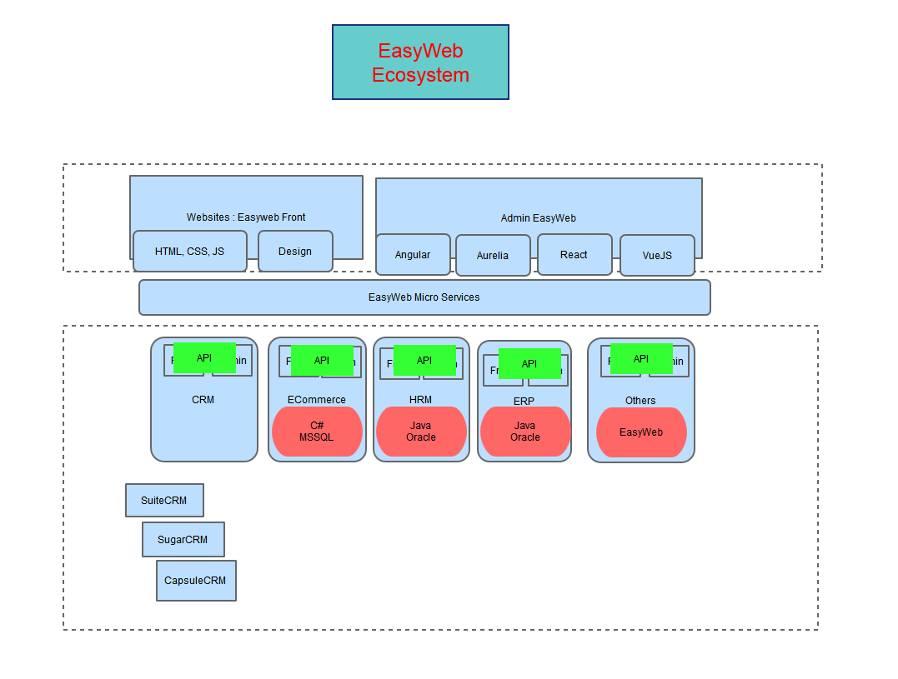

# Khả năng của EasyWeb

## Tổng Quan 
> Quy trình phát triển

## Áp dụng vào Dự án Thực Tế
### 1. Prototype: tạo ra Prototype dựa theo yêu cầu

- Hệ thống EIC:  http://eic-demo.vinaas.com 
- KieuHoi    http://kieuhoi-demo.vinaas.com/
- Hệ thống quản lý SPA: 
    - http://skydiamond.showcase.easywebhub.me/
- Hệ thống quản lý Bất động sản 
    - http://novaland.showcase.easywebhub.me/

> Chi tiết về [Prototype](https://github.com/easywebhub/tasks/blob/master/docs/2018/Prototype.md)

### 1. UserFrontend: Tạo ra website mới từ themes có sẵn hoặc từ websites có sẵn
- https://thuysan247.com
- http://demo.thoibaophuongdong.vn (tạo thời offline)

### 1. StaffAdminCP: tạo ra trang quản trị từ HTML Admin themes có sẵn
- xây dựng dựa trên Prototype 
- tùy chọn Frontend framework sử dụng: SinglePageAppcation (SPA) hoặc Web pages
    - EIC: http://qlgd.eic.com.vn
    - KieuHoi  http://kieuhoi.vinaas.com 

## Hướng phát triển

### (1-1-n+): EasyWeb cho Doanh Nghiệp
> Slide chi tiết, [download](https://github.com/easywebhub/tasks/raw/master/docs/architect/EasyWeb.pptx)

- (1-1-n+) là mô hình gồm
    - 1 UserFront: giao diện dành cho người dùng không cần đăng nhập
    - 1 StaffAdmin: giao diện dành cho Nhân Viên vận hành, hoặc trang quản trị của người dùng sau khi đăng nhập
    - n+ backend: n hệ thống rời rạc với nhiều nghiệp vụ khác nhau. 

## Hệ sinh thái EasyWeb 

- còn bổ sung thêm
