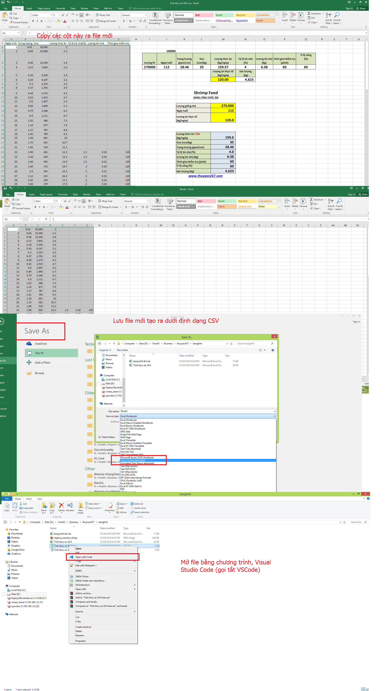
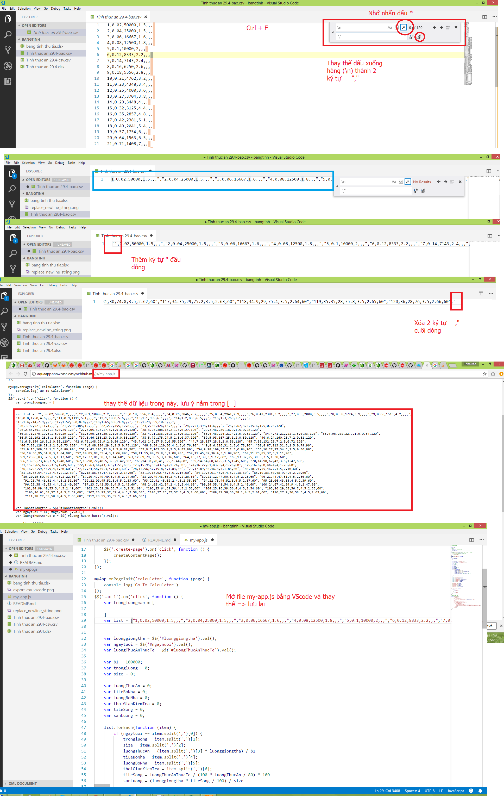

## Cách tạo ra bảng tính

### Xuất bảng kết quả ra file csv

1. copy các cột dữ liệu ra file excel mới
1. lưu file mới dưới dạng CSV 
1. mở file mới bằng chương trình Visual Studio Code có sẵn trong máy [download](https://code.visualstudio.com/)



### Chuyển dữ liệu thành json array

1. dùng tính năng Replace, thay thế dấu xuống hàng từng dòng `\n`, thành dấu chia chuỗi, `","`
  - sẽ chuyển nhiều dòng thành 1 dòng duy nhất
1. thêm dấu `"` vào đầu chuỗi
1. xóa dấu `,"` ở cuối chuỗi 

1. Thay vào dữ liệu bảng tính
    - nằm trong file `/js/my-app.js` , biến `list`
```
 var list = [" ...
```

1. xem hình 


